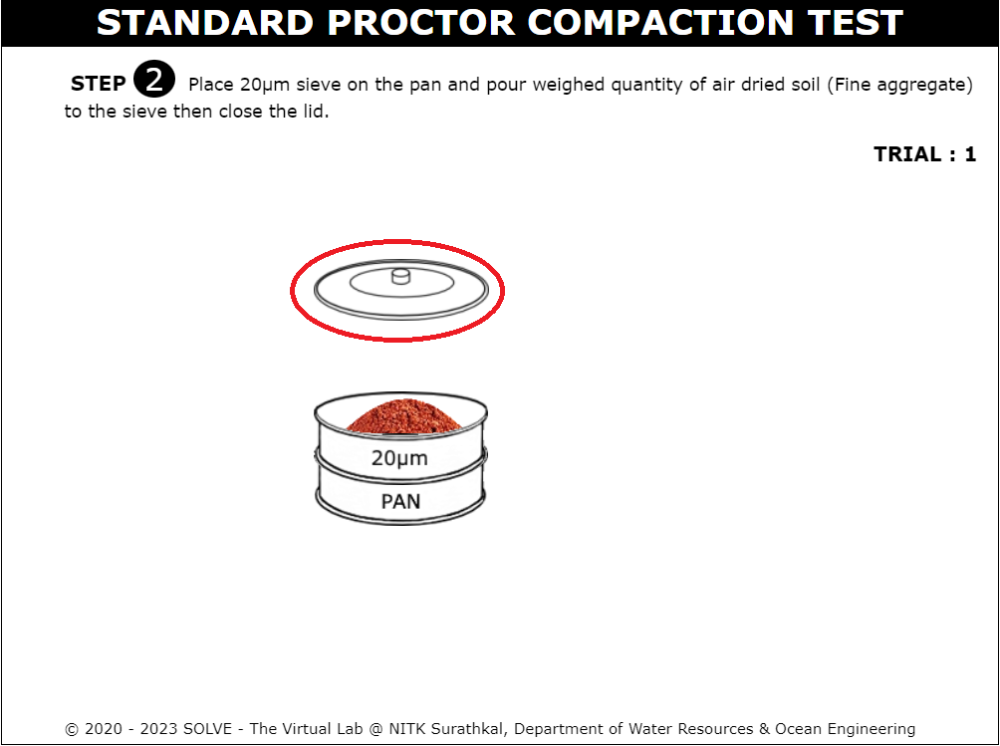
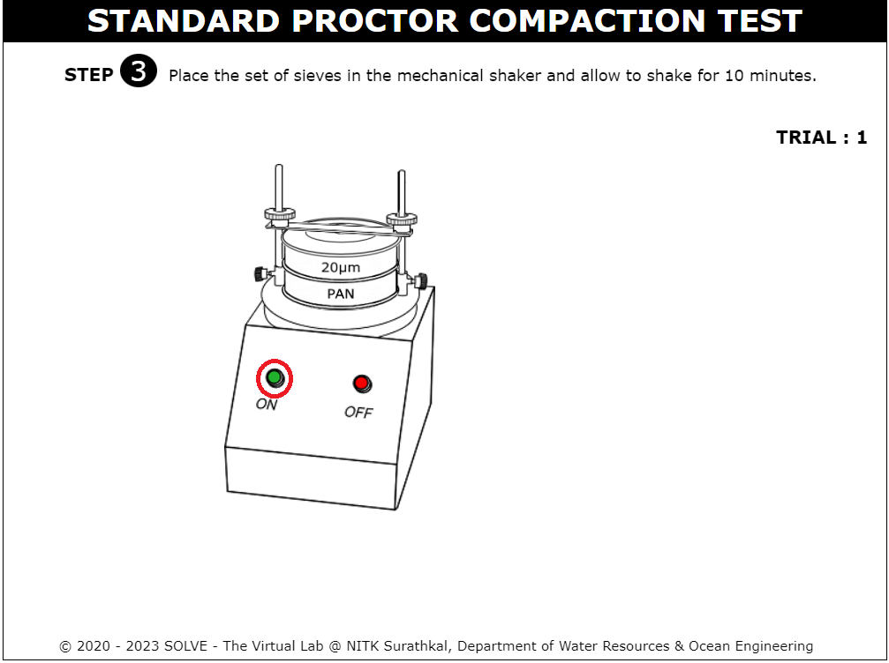
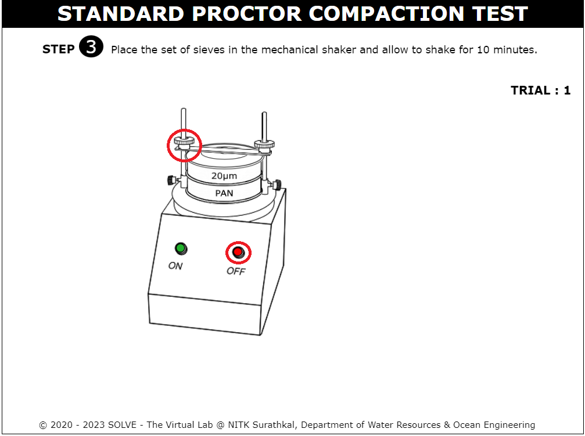
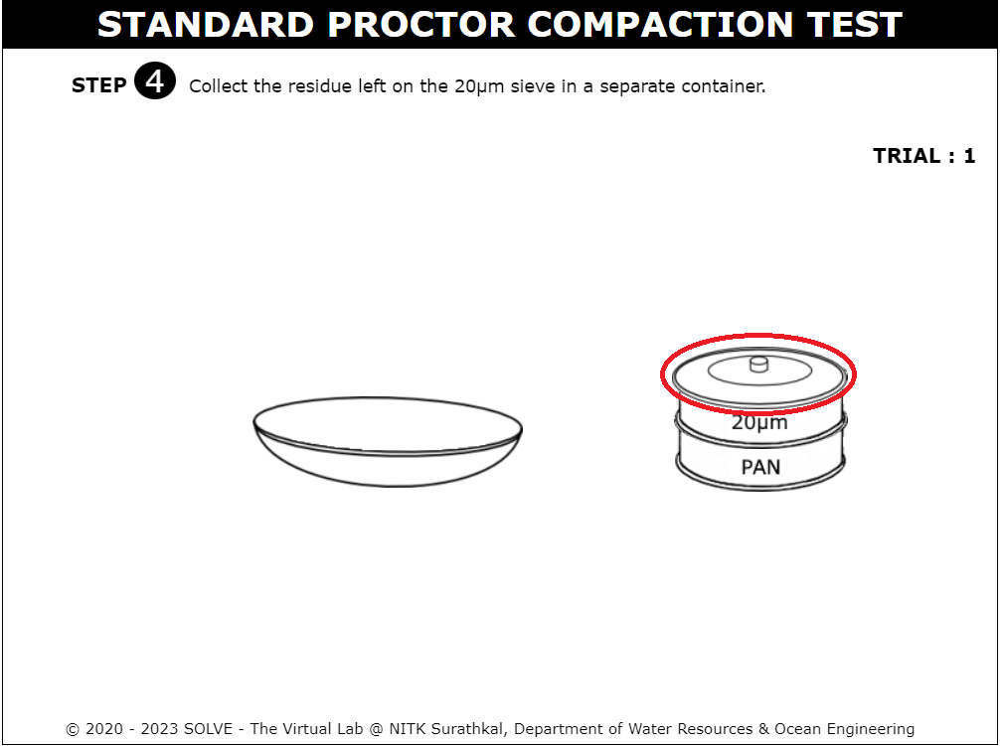
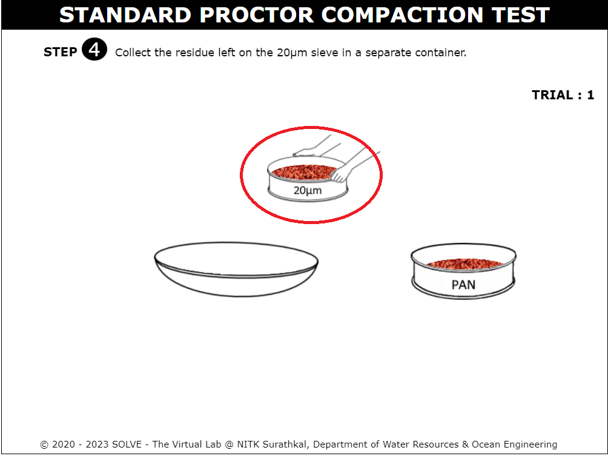
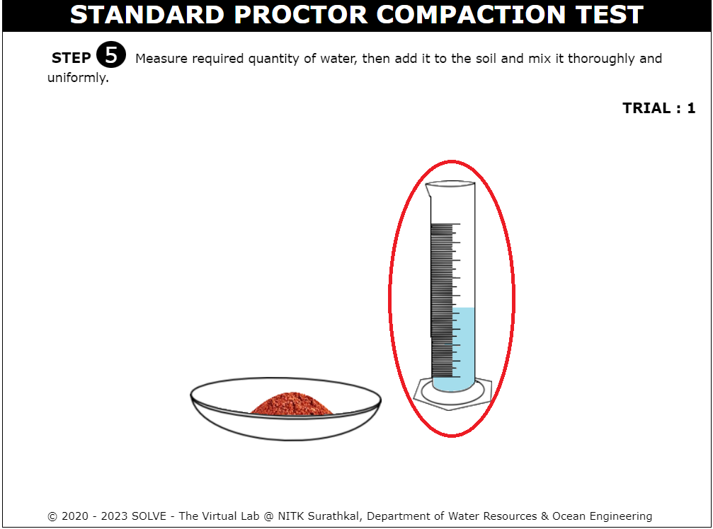
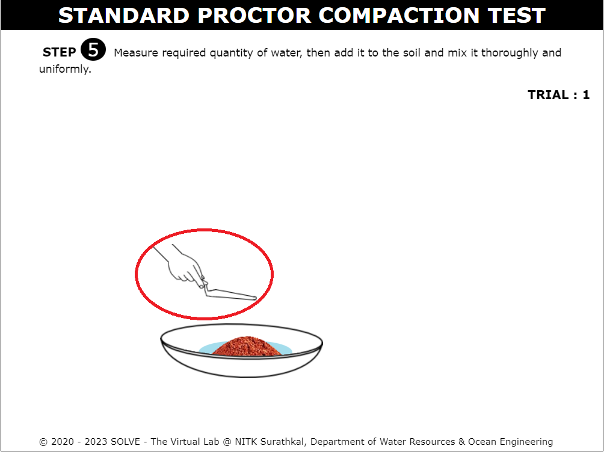

#### These procedure steps will be followed on the simulator

1. When you click on the standard proctor compaction file, a new window will open as shown below; click on the description text box to view the definitions. Click on the Next button at the bottom right corner to move to the next step. 
 

2. Place the pan over the weighing balance by clicking on the arrow mark and take 2kg of air-dried soil sample and click on the next button to move to the next step. 
 

3. Click on the arrow to Place a 20µm sieve on the pan and pour weighed quantity of air-dried soil (Fine aggregate) into the sieve, then close the lid. 
 

4. Answer the question which is appearing on the screen to move to the next step. 
 

5. Click on the Next button at the bottom right corner to move to the next step. 
 

6. Click on the arrow to Place the set of sieves in the mechanical shaker and allow shaking for 10 minutes and click on the next button to move to the next step. 
 
 
 

7. By clicking on the arrow, collect the residue left on the 20µm sieve in a separate container and click on the next button to move to the next step. 
 
 

8. Click on the measuring jar to measure the required quantity of water, then add it to the soil and mix it thoroughly and uniformly by clicking on the arrow mark and move to the next step. 
 
 
 

9. Click on the mould and Measure the weight of the empty mould along with the base plate and click on the Next button. 
 

10. By clicking over the arrow mark, fill the mould in 3 layers with the soil sample. Each layer is compacted by giving 25 evenly distributed blows using the rammer and press the next button. 
 
 

11. Click on the arrow to remove the collar and then remove extra soil from the mould using edge steel and click on the Next button. 
 

12. Click on the arrow to weigh the mould containing the soil sample along with the base plate. 
 

13. Place the empty container by Clicking on the arrow to Measure its weight. 
  

14. Take some soil sample in a container for water content determination by clicking on the arrow mark. 
 

15. Measure the weight of the container with wet soil and click on the Next button. 
 

16. Click on the door of the oven to open and click on the container with wet soil to place inside the oven and set the temperature of the oven to 110&deg;C for 24 hours. 
 
 
 

17. Click on the container to place it over the weighing balance to measure the weight of the dry soil sample, and click on the Next button. 
 

18. Observations and calculations. 
 
