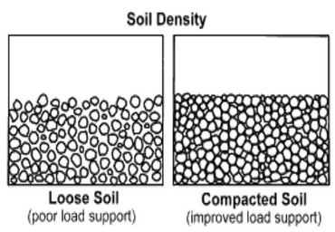

### INTRODUCTION 

Compaction can be generally defined as the densification of soil by removing air and rearrangement of soil particles through the addition of mechanical energy. The degree of compression of soil is measured in terms of its dry density.

<a href="https://www.aboutcivil.org/compaction-of-soil-uses-and-effects.html"> https://www.aboutcivil.org/compaction-of-soil-uses-and-effects.html</a>

When water is added to the soil, it functions as a softening agent on the soil particles, causing them to slide between one another more easily. At first, the dry unit weight after compaction increases as the moisture content increases, but after the optimum moisture content is exceeded, any added water will result in a reduction in dry unit weight because the pore water pressure (pressure of water in-between each soil particle) will be pushing the soil particles apart, decreasing the friction between them.

Compaction of soils increases the density, shear strength but reduces the void ratio, porosity, permeability and settlements. The results of this test are useful in the stability of field structures like earthen dams, embankments, roads and airfields. In such constructions, the soils are compacted. The moisture content at which the soils are compacted in the field is controlled by the value of optimum moisture content determined by the laboratory proctor compaction test.

