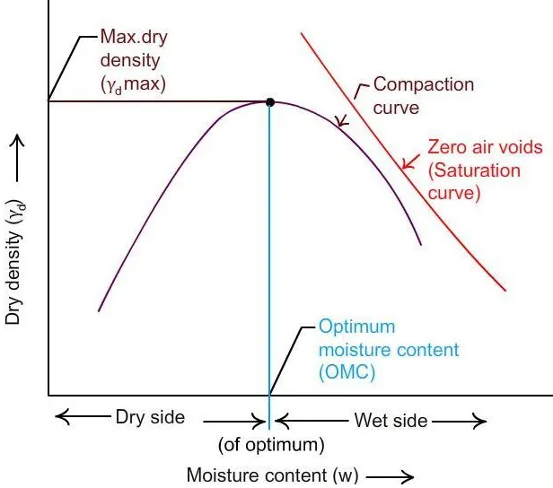

### INTRODUCTION 

When a compressive load is applied over a soil mass, a decrease in volume takes place due to the presence of voids in the soil mass.
This decrease in volume can take place by two ways: 

#### 1. Due to the expulsion of air voids.

This kind of decrease in volume under stress or pressure is known as the compressibility of soil and is a quick process. Here the air voids present in the soil mass gets expelled due to the pressure over it. This phenomenon is called compaction.

#### 2. Due to the expulsion of water voids.

This is a very gradual process where the water from the voids  present in the soil sample gets expelled. Such a compression resulting from long time static load applied over a saturated soil mass and consequent escape of pore water is termed consolidation.

Consolidation of soil only takes place when the compression of soil has already taken place. When pore water is present in the soil, some of the stress is taken by it thus decreasing the load on the soil particles. But as the water begins escaping from the voids, the hydrostatic pressure in the soil slowly gets dissipated thus shifting the load to the soil particle increasing the effective stress on the soil particles as a result soil mass decreases in volume.

The rate of escape of pore water from the soil mass completely depends upon the permeability of the soil. If the permeability is high, the rate of consolidation is also high and vice versa.

Compaction can be generally defined as the densification of soil by removing air and rearrangement of soil particles through the addition of mechanical energy. The degree of compression of soil is measured in terms of its dry density.

#### Dry Density of soil :

Dry density of soil refers to the ratio of total mass of soil to that of its volume in its dry state.

#### Field Density of soil

The in-situ density refers to the mass per unit volume of Soil in the undisturbed state or compacted soil in-place. The moisture content is likely to vary from time and hence the field density also. So it is required to report the test result in terms of dry density.

 

(Source : <a href="https://www.aboutcivil.org/compaction-of-soil-uses-and-effects.html"> https://www.aboutcivil.org/compaction-of-soil-uses-and-effects.html</a>)

When water is added to the soil, it functions as a softening agent on the soil particles, causing them to slide between one another more easily. At first, the dry unit weight after compaction increases as the moisture content increases, but after the optimum moisture content is exceeded, any added water will result in a reduction in dry unit weight because the pore water pressure (pressure of water in-between each soil particle) will be pushing the soil particles apart, decreasing the friction between them.

#### Optimum Moisture Content :

When the soil particles get coated with a film of water around it, the particles will get lubricated because of which the soil can be densely packed resulting in increased density. Now after a certain limit, any increase in the water content in the soil does not increase the density of the soil rather it decreases the density of soil. This maximum water content is termed as the Optimum Moisture Content of the soil.

#### Maximum Dry Density :

The dry density corresponding to this optimum moisture content value is termed as maximum dry of soil for the specific competitive effort.

 

(Source : <a href="https://i0.wp.com/civilblog.org/wp-content/uploads/2015/12/Fig-1-Moisture-content-dry-density-relationship.jpg?resize=640%2C606&ssl=1"> hhttps://i0.wp.com/civilblog.org/wp-content/uploads/2015/12/Fig-1-Moisture-content-dry-density-relationship.jpg?resize=640%2C606&ssl=1</a>)

Compaction of soils increases the density, shear strength but reduces the void ratio, porosity, permeability and settlements. The results of this test are useful in the stability of field structures like earthen dams, embankments, roads and airfields. In such constructions, the soils are compacted. The moisture content at which the soils are compacted in the field is controlled by the value of optimum moisture content determined by the laboratory proctor compaction test.

